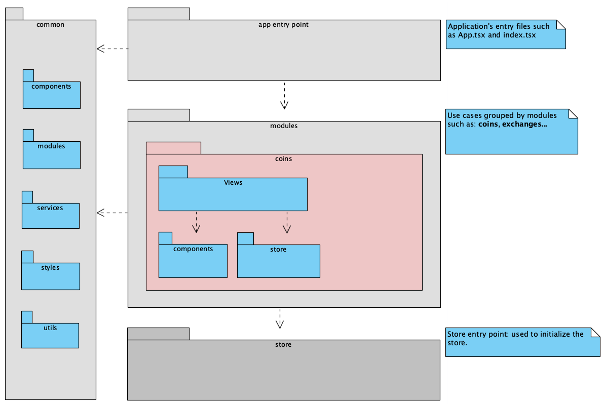
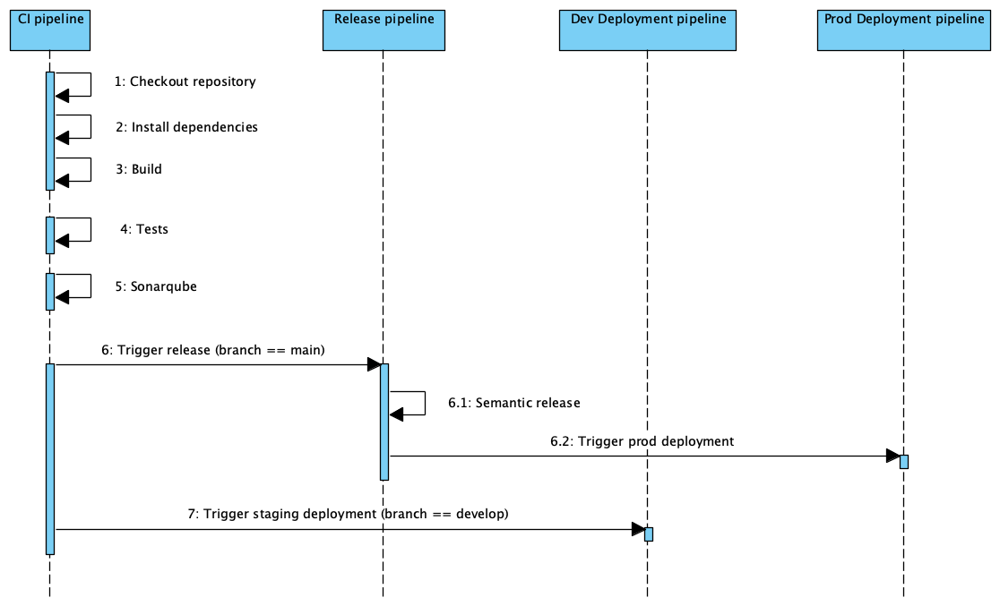

# CoinGecko Dashboard Copycat

## Architecture

- `common`: It contains the backbone of the whole application, including views, components, utils, styles, and any generic asset or script needed to assemble the application.
- `modules`: It contains the implementation of the use cases bounded to the application.
- `app entry point`: It contains all the entry point scripts and components of the application.

## Project setup

- ✅ CI - Gitlab CI
- ✅ Commit linter - [Commitlint](https://commitlint.js.org/#/)
- ✅ Semantic releasesa and auto-versioning (semver) - [semantic-release](https://semantic-release.gitbook.io/semantic-release/)
- ✅ Static code analysis - [Sonarqube](https://sonarqube.changani.me/dashboard?id=flowck_coingecko-dashboard-copycat-react)
- ⚠️ Lighthouse analysis

## Environments

- Production `main` - [coingecko-dashboard-react.changani.me](https://coingecko-dashboard-react.changani.me)
- Development `develop` - [dev.coingecko-dashboard-react.changani.me](https://dev.coingecko-dashboard-react.changani.me)

## Naming conventions

- Store modules: `moduleName.fileName.ts`
- Module Views: `moduleName.viewName.tsx`
- Components: `componentName.tsx`, `componentName.style.tsx`

## Continuous Integration and Continuous Delivery flow

> More info to come
